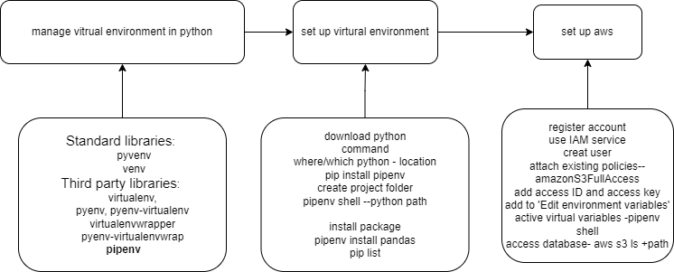
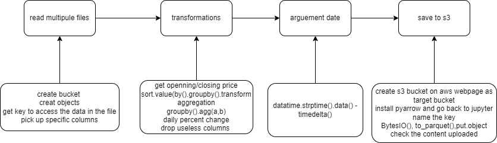
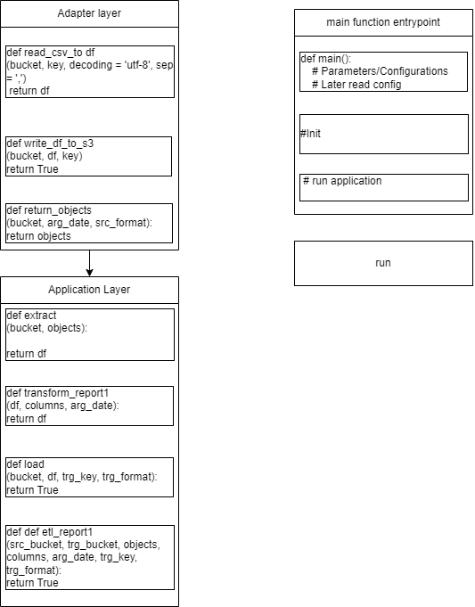
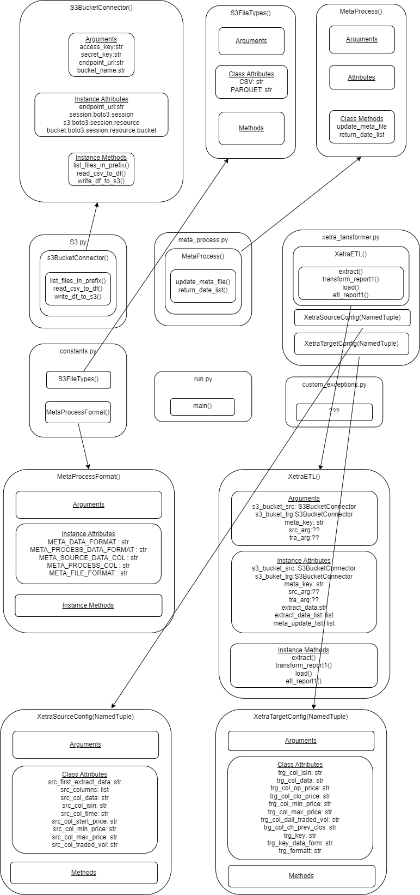
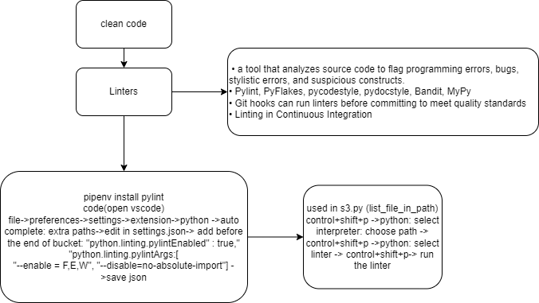
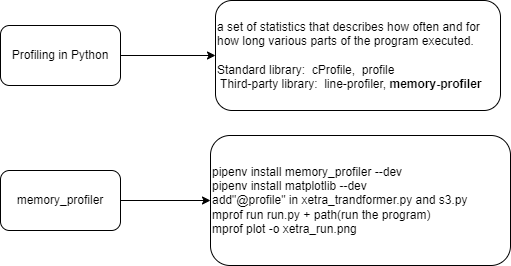

# AWS python pipline design

## Introduction
Xetra (Market Identifier Code: XETR) is a trading venue operated by the Frankfurt Stock Exchange based in Frankfurt, Germany. In 2015, 90 percent of all trading in shares at all German exchanges was transacted through the Xetra trading venue. With regard to DAX listings, Xetra has 60 per cent market share throughout Europe. The prices on Xetra serve as the basis for calculating the DAX, the best-known German share index. 

This project generates weekly data job to use python move and process raw data in Xetra S3 Bucket and generate the report file to Target S3 Bucket. The resources data provides ISIN, Date, Time, StartPrice, MaxPrice, MinPrice, EndPrice, TradedVolume for every minute of the trading day. And we will process the data and get	opening_price,	closing_price,	min_price, max_price, traded_volume	and the percentage_change(pct) for each ISIN and make them to the report file.

## overview and steps
- Set up a virtual environment and AWS
- Understanding the source data, quick and dirty solution using Jupyter Notebook
- Functional approach with the quick and dirty solution
- OOP Design principles and further requirements - Configuration, Logging, Meta Data
- OOP Code Design
- Impliment class frame and Logging
- Coding (Clean Code, fucntionality, linting, unit tests, integration tests)
- Performance tuning with profiling and timing
- Create Dockerfile + push docker image to Docker Hub
- Run application in production using a Minikube and Argo Workflows

 ### Set up a virtual environment
 use pipenv to create and active a virtual environment of python 3.8
 
 
 
 
 ### quick and dirty source data
 use Jupyter Notebook to read multipule files, transformations and save to s3 Bucket in AWS.
 
  
 
 
 ### Functional approach
 create function in Adapter layer, Application Layer and create main function entrypoint.
 
   
 
 ### OOP Code Design and Impliment
 add logging(using pyyaml) and Meta data
 create s3BucketConnector(), MetaProcess(), XetraETL(), XetraSourceConfig(NamedTuple), XetraTargetConfig(NamedTuple), S3FileTypes(), MetaProcessFormat() to edit methods.
  
   
  
 ### Coding
 add Linters (pylint) to clean code and use unit tests(moto package) and integration tests to test each unit and framework.
 
  
 
 ### Performance tuning with profiling and timing
 using memory_profiler to improve performance
 
   

## lesson learned
The whole functional approach and OOP Design design of the project, especially for the control and optimize code.
For example, the project uses logging and configure file (yaml) to avoid requirement and environment changes to recode and retest, meta file for job control to avoid repeat reports being created and memory_profiler to show how often and for how long various parts of the program are executed.
